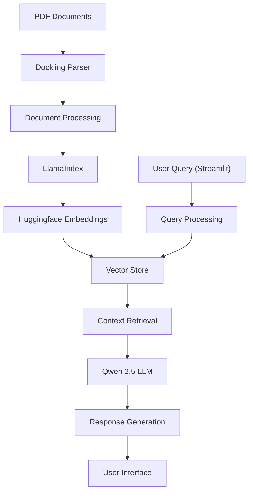

# Local RAG System with LlamaIndex, Dockling, and Qwen LLM

## Project Overview
A local RAG (Retrieval-Augmented Generation) implementation using LlamaIndex for orchestration, Streamlit for frontend interface, Dockling for PDF parsing, and Qwen 2.5 LLM for text generation.

---

## Project Demo Video
https://github.com/user-attachments/assets/89e3d934-e70d-4373-afa6-7b9a1a3e421f

---

## Architecture Diagram

---

## Flow Diagram

---

## 🚀 Key Features

- **Local Processing:** All operations performed locally for data privacy and security
- **PDF Handling:** Efficient PDF parsing and processing using Dockling
- **Vector Search:** Advanced document retrieval using Huggingface embeddings
- **Interactive UI:** User-friendly interface built with Streamlit
- **LLM Integration:** Powerful text generation using Qwen 2.5 model

---

## 🛠️ Tech Stack

| Component | Technology |
| --- | --- |
| Orchestration | LlamaIndex |
| Frontend | Streamlit |
| PDF Processing | Dockling |
| Embeddings | Huggingface |
| LLM | Qwen 2.5 |

---

## 📦 Use Cases

- **Document Q&A:** Query your PDF documents using natural language
- **Information Retrieval:** Efficient search across large document collections
- **Context-Aware Responses:** Generate responses based on document context
- **Document Analysis:** Extract insights from PDF documents

---

## Development Approach

- Implementing local vector storage for document embeddings
- Using Streamlit for rapid UI development
- Leveraging LlamaIndex for efficient document processing
- Optimizing PDF parsing with Dockling
- Integration of Qwen 2.5 LLM for high-quality responses
